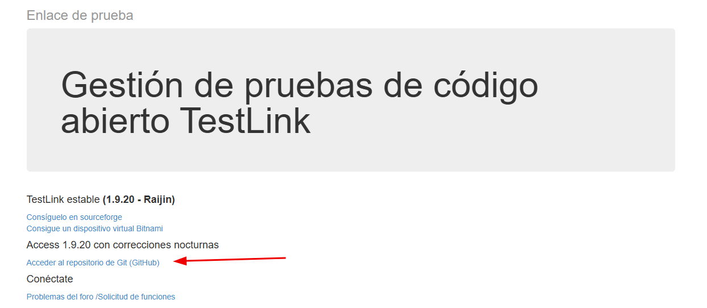
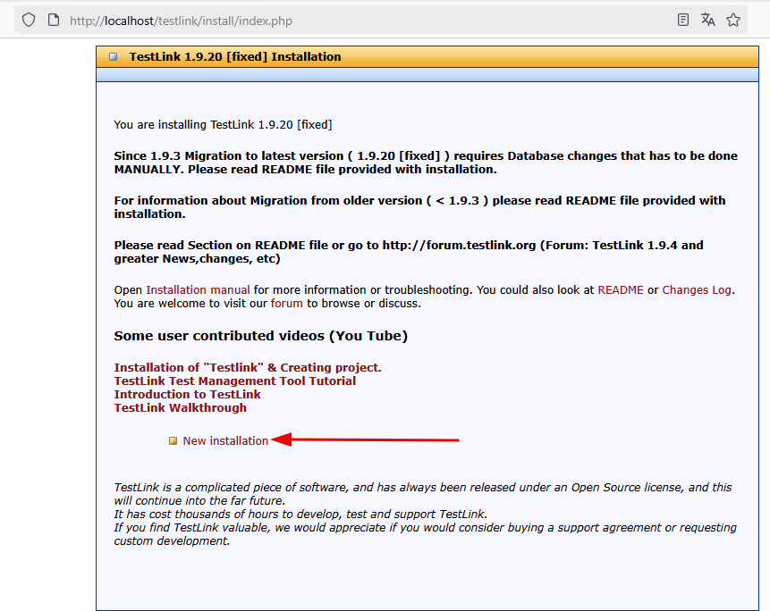
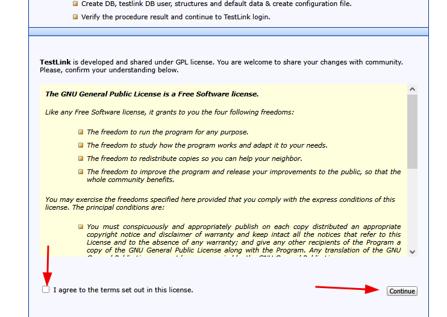
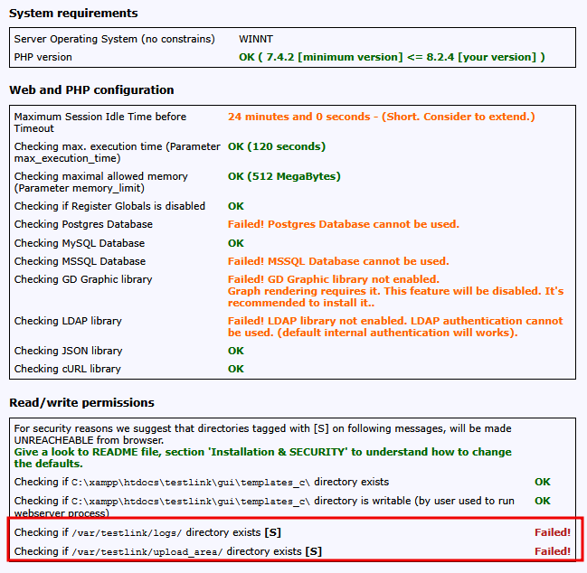
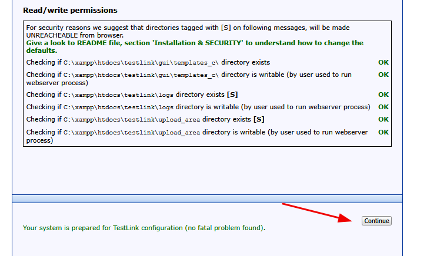
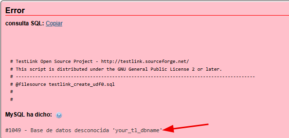
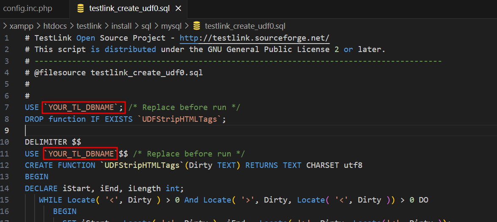
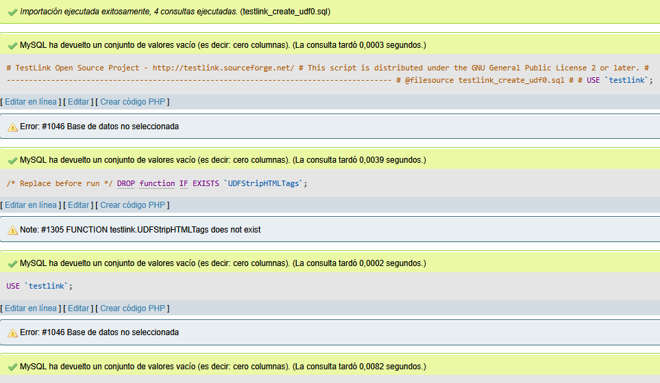
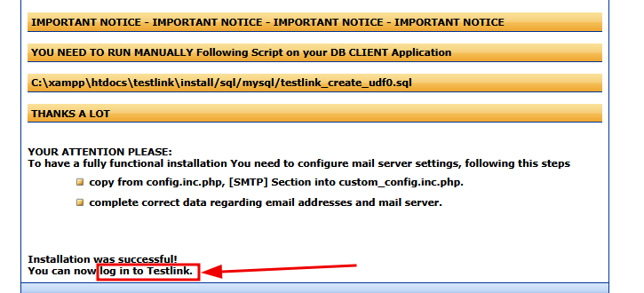
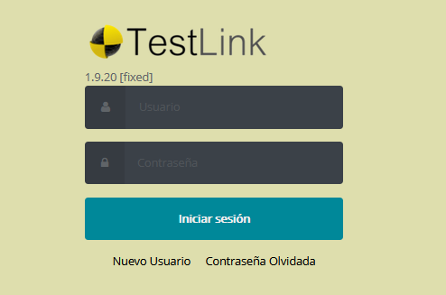

# tutorialinstal-testlink-windows
Entre las muchas herramientas de gestion de pruebas de software, elegi TestLink. Este software ya lo habia utilizado en una maquina virtual, posteriormente tenia la necesidad de utilizarlo en en mi sistema operativo.
Busque mas información y videos al respecto para poder realizar la instalación, quiero compartir mis resultados con quien lo necesite.

## Introducción
Tutorial sobre la instalación de TestLink en Windows para gestionar los casos de prueba.

## Requisitos

Para llevar a cabo esta instalación tomar en cuenta los siguientes puntos:

- Tener Windows 10 
- Instalación previa de XAMPP v3.3.0
- Descargar TestLink desde github
- Editor de texto Visual Studio Code (opcional)

## Implementación
Instalar XAMPP en el equipo. 
> **Nota**. revise manual de instalacion en caso de ser necesario [manual xampp](https://www.apachefriends.org/es/index.html)

Descagar TestLink desde github en donde tienen la correccion de sus errores  [github TestLink](https://github.com/TestLinkOpenSourceTRMS/testlink-code/tree/testlink_1_9_20_fixed/) descargar en zip y descomprimir en una carpeta.

En la ruta de **C:\xampp\htdocs** crear una carpeta con el nombre de **testlink**, en la cual se copiara el contenido que se descomprimio previamente.
Iniciar el servidor de Xampp y crear base de datos con el nombre **testlink** ingresar en el navegador: **localhost/testlink**  hacer clic en: **nueva instalacion** > **agregar terminos y condiciones** > **continuar**

Se puede observar que se tiene un error

Abrir con el editor el archivo **config.inc.php** de la ruta C:\xampp\htdocs\testlink\config.inc.php, se modificara codigo. 
1. Realizar la busqueda de: $g_repositoryPath en el archivo y modificar por lo siguiente: $g_repositoryPath = '**C:\xampp\htdocs\testlink\upload_area**';
2. Realizar la busqueda de: $tlCfg->log_path en el archivo y modificar: $tlCfg->log_path = '**C:\xampp\htdocs\testlink\logs**';

Guardar archivo y volver a cargar el navegador, el error no se visualiza hacer clic en el boton **continuar**.

Agregar iformacion sobre la base de datos, agregar el nombre de la base de datos en nuestro caso **testlink**

Agregar los accesos de PHPmyadmin en mi caso solo tengo un super usuario root sin contraseña. 
Agregar los datos de usuario y contraseña para test link. Hacer clic en el boton **proceso configuracion Testlink.**
El sistema pide que se ejecute una linea de testlink_create_udf0.sql, para ello vamos a **phpmyadmin**>**importar**>**buscar archivo**>**seleccionar  testlink_create_udf0.sql** hacer clic en boton **importar**. 

Esto nos muestra un error que indica que no tiene el nombre de la base de datos, para ello abrimos el archivo **testlink_create_udf0.sql** en un editor y le remplazaremos el nombre por **testlink** guardar archivo.

Volver a importar y ejecutar el archivo desde phpmyadmin, el resultado debe ser una importacion ejecutada exitosamente.

Recargar el navegador en la pestaña en la que se tiene la instalacion de testlink, en la parte inferior hacer clic en **login in to testlink**

Ingresar los datos que previamente creaste para testlink el usuario y constraseña > **inicia sesion**.
Si llegaste hasta ese punto, instalaste correctamente testlink en tu equipo.

Se pone a disposicion mas imagenes para guia de la instalacion en la carpeta img, revisar en caso de ser necesario

